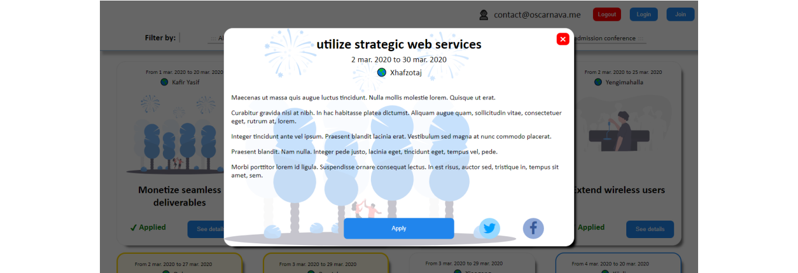
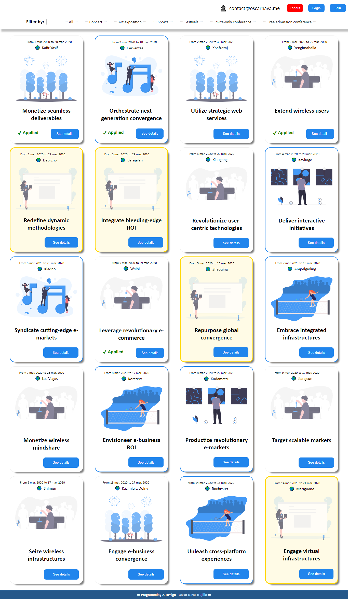

# Events page

This project is the result of an **HTML/CSS/JavaScript** challenge to create a web page to display upcoming events information in small panels, allowing the user to filter the type of event they want to see (or all if that's the case). Also, there are paying users (VIP) and non-paying ones, so access to the different events also depends on the type of user.

### As a user it lets you:

* Display more details of an event.
* Apply to an event and see confirmation of your application.
* You can share the event with a friend through Twitter & Facebook.
* Non-VIP logged users see a friendly error warning when trying to apply for an invite-only event, with a call to action to read more about a membership plan.
* Concert, art exposition, and sports events visually stand out to non-VIP users.
* Distinguish invite-only events from the free admission ones.

### Other features are:
* To create a new user, use the 'Join' button and indicate if it's VIP or not. Joining logs you in automatically.
* Since this is a front-end project, the Join, Log-in and Logout functions were simulated in local storage. They persist between sessions but don't involve any communication with a server.
* Join and Login require a valid email and password.
* A logged user persists between sessions.
* A VIP user is indicated with a crown (👑) to the left.

## Built with:
- JavaScript
- HTML
- SASS / CSS
- ☕☕☕ Coffee

## Live demo
- [Events page](https://oscarnava.me/events-page/)

## 👤 Author
  ### *Oscar Nava Trujillo*
  - email: [contact@oscarnava.me](mailto:contact@oscarnava.me)
  - Github: [@oscarnava]( https://github.com/oscarnava )
  - Linkedin: [Oscar Nava Trujillo](https://www.linkedin.com/in/oscar-nava-trujillo-15847a14a/)

## ⌛ To-do's
- [ ] The app is responsive in general but the filter menu does not display very nice in small screens; this is an aspect that needs improving.
- [ ] To clear all users, issue the command ___localStorage.clear()___ in the JavaScript browser's console. Maybe a nice feature would be adding a button for this.

## 📦 Contributing
Contributions, issues and feature requests are welcome!

Feel free to check the [issues page](https://github.com/oscarnava/events-page/issues).

## 📡 Contact

Please don't hesitate to contact me at 📧 [contact@oscarnava.me](mailto:contact@oscarnava.me) if you have any questions, comments, etc. I would love to know what's on your mind!

## 🗝 License
Creative Commons [Attribution 4.0 International (CC BY 4.0)](https://creativecommons.org/licenses/by/4.0/)
